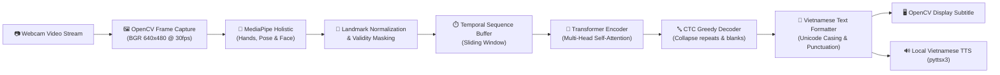

# 🤟 Vietnamese Sign Language (VSL) AI Recognition System
### Hệ Thống Nhận Diện Ngôn Ngữ Ký Hiệu Tiếng Việt Thời Gian Thực Qua Webcam

[](https://www.python.org/)
[](https://pytorch.org/)
[](https://developers.google.com/mediapipe)
[](https://opencv.org/)
[](https://developer.nvidia.com/cuda-zone)
[](https://opensource.org/licenses/MIT)

---

## 📌 Mục Lục (Table of Contents)
- [1. Giới thiệu tổng quan (Overview)](#1-giới-thiệu-tổng-quan-overview)
- [2. Tính năng nổi bật (Key Features)](#2-tính-năng-nổi-bật-key-features)
- [3. Kiến trúc hệ thống (System Architecture)](#3-kiến-trúc-hệ-thống-system-architecture)
- [4. Chi tiết kỹ thuật & Giải pháp (Technical Deep Dive)](#4-chi-tiết-kỹ-thuật--giải-pháp-technical-deep-dive)
- [5. Bộ dữ liệu huấn luyện (Dataset)](#5-bộ-dữ-liệu-huấn-luyện-dataset)
- [6. Kết quả thực nghiệm (Experimental Results)](#6-kết-quả-thực-nghiệm-experimental-results)
- [7. Cấu trúc thư mục dự án (Project Directory Structure)](#7-cấu-trúc-thư-mục-dự-án-project-directory-structure)
- [8. Yêu cầu hệ thống (System Requirements)](#8-yêu-cầu-hệ-thống-system-requirements)
- [9. Hướng dẫn cài đặt (Installation Guide)](#9-hướng-dẫn-cài-đặt-installation-guide)
- [10. Hướng dẫn sử dụng (Usage Guide)](#10-hướng-dẫn-sử-dụng-usage-guide)
  - [10.1. Chạy nhận diện trực tiếp qua Webcam](#101-chạy-nhận-diện-trực-tiếp-qua-webcam)
  - [10.2. Chuẩn bị dữ liệu và trích xuất đặc trưng](#102-chuẩn-bị-dữ-liệu-và-trích-xuất-đặc-trưng)
  - [10.3. Huấn luyện mô hình từ đầu (Training)](#103-huấn-luyện-mô-hình-từ-đầu-training)
  - [10.4. Đánh giá chất lượng mô hình (Evaluation)](#104-đánh-giá-chất-lượng-mô-hình-evaluation)
  - [10.5. Các Notebook nghiên cứu thực nghiệm](#105-các-notebook-nghiên-cứu-thực-nghiệm)
- [11. Tùy chỉnh cấu hình (Configuration - config.yaml)](#11-tùy-chỉnh-cấu-hình-configuration---configyaml)
- [12. Kiểm thử phần mềm (Testing)](#12-kiểm-thử-phần-mềm-testing)
- [13. Giới hạn hiện tại & Hướng phát triển (Limitations & Roadmap)](#13-giới-hạn-hiện-tại--hướng-phát-triển-limitations--roadmap)
- [14. Tác giả & Bản quyền (Authors & License)](#14-tác-giả--bản-quyền-authors--license)

---

## 1. Giới thiệu tổng quan (Overview)

Ngôn ngữ ký hiệu là phương tiện giao tiếp chủ đạo của cộng đồng người khiếm thính. Tuy nhiên, rào cản giao tiếp giữa người khiếm thính và cộng đồng người nghe vẫn còn rất lớn. 

Dự án này xây dựng một hệ thống **AI nhận diện Ngôn ngữ Ký hiệu Tiếng Việt (Vietnamese Sign Language - VSL)** hoàn chỉnh và chạy **thời gian thực (real-time)** trực tiếp trên máy tính qua Webcam thông thường. 

Hệ thống kết hợp sức mạnh của:
- **MediaPipe Holistic:** Trích xuất các điểm mốc khớp xương (landmarks) bàn tay và cơ thể từ từng khung hình mà không cần phụ thuộc vào bối cảnh nền hay trang phục.
- **Chuẩn hóa đặc trưng không gian (Spatial Normalization):** Triệt tiêu sai khác về khoảng cách đứng gần/xa và vị trí đứng trước camera.
- **Transformer Encoder:** Mô hình Deep Learning hiện đại dựa trên cơ chế Self-Attention giúp nắm bắt sự phụ thuộc theo thời gian (temporal dependencies) của các chuỗi chuyển động.
- **Connectionist Temporal Classification (CTC Loss & Decoder):** Cho phép học chuỗi ký hiệu chuyển động mà **không cần gán nhãn thủ công từng khung hình** (frame-by-frame annotation).
- **Phụ đề tiếng Việt Unicode & Text-to-Speech (TTS):** Xuất phụ đề tiếng Việt có dấu trực quan và phát âm thanh đọc từ/câu vừa nhận diện qua loa máy tính.

---

## 2. Tính năng nổi bật (Key Features)

- ⚡ **Xử lý siêu nhanh (Real-Time > 30 FPS):** Mô hình chỉ xử lý vector đặc trưng tọa độ khớp thay vì video RGB nặng nề, giúp tốc độ phản hồi gần như tức thì.
- 🖐️ **Trích xuất đa khớp xương:** Theo dõi chi tiết 21 khớp xương bàn tay trái, 21 khớp xương bàn tay phải, 33 khớp dáng người (pose) và các điểm khuôn mặt.
- 🎯 **Cơ chế chuẩn hóa nâng cao:** Tọa độ khớp được chuẩn hóa theo gốc cổ tay và độ rộng vai, kèm kênh **validity mask** giúp mô hình phân biệt điểm bị che khuất với điểm gốc `(0, 0, 0)`.
- 🔄 **Cửa sổ trượt suy luận (Sliding Window Inference):** Cơ chế đệm khung hình trượt gối đầu liên tục (overlapping sliding buffer), tự động làm mịn nhãn theo thời gian, lọc ngưỡng tin cậy và tự động phát hiện khoảng lặng (silence / low motion).
- 🔊 **Phát âm Text-to-Speech (TTS) Tiếng Việt:** Tích hợp engine đọc giọng nói tiếng Việt tự động mà không cần kết nối Internet hay API trả phí.
- 🚀 **Tối ưu phần cứng tự động:** Hỗ trợ GPU NVIDIA CUDA (tăng tốc Mixed Precision FP16) và cơ chế tự động fallback về CPU mượt mà nếu máy không có GPU rời.
- 🧪 **Kiến trúc mã nguồn chuẩn chỉ:** Cấu trúc module hóa rõ ràng, có đầy đủ 12 test suites kiểm thử đơn vị (`pytest`) và 5 Jupyter Notebooks nghiên cứu từng bước.

---

## 3. Kiến trúc hệ thống (System Architecture)

Luồng hoạt động tổng thể từ khi camera thu nhận hình ảnh đến khi xuất phụ đề và âm thanh:



### Chi tiết các tầng xử lý:
1. **Camera Capture:** Đọc từng khung hình từ camera cục bộ bằng OpenCV với độ phân giải tiêu chuẩn 640x480.
2. **MediaPipe Holistic:** Trích xuất tọa độ 3D $(x, y, z)$ của từng điểm mốc khớp xương và mức độ nhìn thấy (visibility).
3. **Feature Normalization:** 
   - Tọa độ bàn tay được tịnh tiến về gốc cổ tay (wrist-centered) và chia tỉ lệ theo khoảng cách từ cổ tay tới khớp giữa bàn tay (MCP distance).
   - Tọa độ dáng người được căn chỉnh theo điểm mốc hai vai (shoulder anchor).
   - Ghép thêm kênh `validity mask` để đánh dấu khớp nào thực sự nhìn thấy.
4. **Sliding Window Buffer:** Lưu trữ cửa sổ trượt (mặc định 30 frames, bước nhảy 1 frame) để đảm bảo không bị ngắt quãng giữa các cử chỉ.
5. **Transformer Model:** Chiếu đặc trưng đầu vào lên không gian ẩn $d_{model}=256$, cộng mã hóa vị trí hình sin (Sinusoidal Positional Encoding), đi qua 4 tầng Transformer Encoder với 8 attention heads.
6. **CTC Decoder:** Ánh xạ xác suất từng frame về các token từ vựng ký hiệu, khử nhãn trùng lặp liên tiếp và loại bỏ token khoảng trống (`blank`).
7. **Hậu xử lý & Hiển thị:** Chuẩn hóa chữ hoa/thường, ghép từ tiếng Việt Unicode hiển thị lên màn hình OpenCV và kích hoạt luồng phát âm thanh riêng biệt.

---

## 4. Chi tiết kỹ thuật & Giải pháp (Technical Deep Dive)

### 4.1. Không gian đặc trưng (Feature Vector)
Mỗi khung hình được chuyển đổi thành một vector 1D phẳng (flattened vector):
- **Bàn tay trái (Left Hand):** 21 điểm $\times$ (3 tọa độ chuẩn hóa + 1 validity mask) = 84 đặc trưng.
- **Bàn tay phải (Right Hand):** 21 điểm $\times$ (3 tọa độ chuẩn hóa + 1 validity mask) = 84 đặc trưng.
- **Dáng người (Pose):** 33 điểm $\times$ (3 tọa độ chuẩn hóa + 1 validity mask) = 132 đặc trưng.
- *(Tùy chọn khuôn mặt - Face Subset: 17 điểm quan trọng xung quanh miệng và mắt).*

Tổng số chiều đặc trưng mỗi khung hình: **$F = 300$** (hoặc $368$ nếu bật khuôn mặt).

### 4.2. Mạng Transformer Encoder + CTC
- **Self-Attention:** Giúp mô hình đồng thời nhìn thấy toàn bộ diễn biến cử chỉ (bắt đầu nhấc tay, thực hiện hình dạng ngón tay, di chuyển không gian, và hạ tay).
- **Hàm mất mát CTC (Connectionist Temporal Classification Loss):** Giải quyết vấn đề tốc độ cử chỉ khác nhau giữa các người thực hiện (người làm nhanh, người làm chậm) mà không cần can thiệp cắt ghép video thủ công.

```text
Chuỗi khung hình:  [f1, f2, f3, f4, f5, f6, f7, f8, f9, f10]
Dự đoán Frame:     [ - ,  - , "XIN", "XIN",  - ,  - , "CHÀO", "CHÀO",  - ,  - ]
Kết quả CTC giải mã: "XIN CHÀO"
```

---

## 5. Bộ dữ liệu huấn luyện (Dataset)

Hệ thống được huấn luyện và kiểm thử toàn diện trên bộ dữ liệu **Ngôn ngữ ký hiệu tiếng Việt 3 Miền (VSL 3-Region: Bắc - Trung - Nam)** với quy mô lớn:
- **Số lớp từ vựng (Classes):** `3,315` nhãn ký hiệu độc lập phong phú từ vựng giao tiếp thực tế.
- **Tổng số mẫu:** `184,295` chuỗi đặc trưng chuẩn hóa trích xuất từ các video cử chỉ.
- **Phân chia tập dữ liệu (Stratified Held-Out Split):**
  - 🏋️ **Tập huấn luyện (Train):** `145,019` mẫu
  - 🔍 **Tập kiểm tra độ hợp lệ (Validation):** `17,980` mẫu
  - 🧪 **Tập kiểm thử độc lập (Test):** `21,296` mẫu
- **Định dạng đặc trưng:** Cấu trúc vector 201 chiều (`vsl_201` gồm Pose 25 $\times$ 3, Bàn tay trái 21 $\times$ 3, Bàn tay phải 21 $\times$ 3), độ dài 60 khung hình/mẫu, lưu trữ dạng `.npz` và quản lý đồng bộ qua metadata CSV.

---

## 6. Kết quả thực nghiệm (Experimental Results)

Đánh giá trên tập kiểm thử độc lập (Held-Out Test Set gồm **21,296 mẫu** trên toàn bộ 3.315 lớp):

| Chỉ số đánh giá | Giá trị đạt được | Ý nghĩa |
| :--- | :---: | :--- |
| **Độ chính xác từ (Exact Word Accuracy)** | **99.85%** | Tỉ lệ nhận diện chính xác hoàn toàn nhãn cử chỉ VSL (21.264/21.296 mẫu) |
| **Tỉ lệ lỗi từ (Word Error Rate - WER)** | **0.16%** | Sai lệch ở cấp độ từ vựng |
| **Tỉ lệ lỗi ký tự (Character Error Rate - CER)** | **0.16%** | Sai lệch ở cấp độ chuỗi ký tự Unicode |
| **Hàm mất mát Test (Test CTC Loss)** | **0.0085** | Mô hình đạt mức hội tụ tối ưu, không bị overfitting |
| **Tốc độ suy luận (Inference Speed)** | **> 30 FPS** | Suy luận thời gian thực mượt mà qua camera (khoảng trễ ~25–35ms) |

---

## 7. Cấu trúc thư mục dự án (Project Directory Structure)

```text
SIGN LANGUAGE DEEPLEARNING PROJECT/
├── app.py                     # Entry point chính: Khởi chạy nhận diện qua Webcam
├── inference.py               # Module quản lý pipeline suy luận và hiển thị giao diện OpenCV
├── train.py                   # Script huấn luyện mô hình Transformer với hàm mất mát CTC
├── evaluate.py                # Đánh giá checkpoint mô hình trên tập kiểm thử Test
├── config.yaml                # Cấu hình trung tâm toàn bộ hệ thống (Model, Data, Realtime, TTS)
├── requirements.txt           # Danh mục thư viện Python phụ thuộc
├── run_camera.bat             # Phím tắt chạy nhanh camera trên Windows bằng 1 cú nhấp chuột
├── setup_windows.bat          # Script tự động khởi tạo môi trường Python 3.10 và cài thư viện
├── DATASET_SETUP.md           # Hướng dẫn chi tiết chuẩn bị và trích xuất bộ dữ liệu
├── PROJECT_REPORT.md          # Báo cáo kỹ thuật chi tiết của dự án
├── README.md                  # Tài liệu hướng dẫn sử dụng toàn diện
├── scripts/
│   ├── import_vsl100.py       # Import & tiền xử lý video VSL100 gốc từ nguồn dữ liệu
│   └── prepare_dataset.py     # Trích xuất landmarks qua MediaPipe và tạo split metadata
├── src/                       # Mã nguồn lõi của hệ thống
│   ├── data/
│   │   ├── augmentation.py    # Tăng cường dữ liệu (noise, scale, rotation, temporal crop)
│   │   ├── dataset.py         # PyTorch Dataset & DataLoader nạp đặc trưng .npy
│   │   ├── history.py         # Quản lý bộ đệm lịch sử cử chỉ
│   │   ├── preprocessing.py   # Làm sạch chuỗi và kiểm tra tính hợp lệ
│   │   └── tokenizer.py       # Bộ mã hóa ánh xạ từ vựng VSL sang ID số
│   ├── features/
│   │   ├── landmark_extractor.py # Trích xuất khớp xương qua MediaPipe Holistic
│   │   └── normalization.py      # Chuẩn hóa tọa độ khớp theo nhóm (Wrist/Shoulder)
│   ├── models/
│   │   ├── ctc_decoder.py        # Giải mã CTC Greedy & CTC Prefix Beam Search
│   │   ├── positional_encoding.py# Mã hóa vị trí hình sin (Sinusoidal Positional Encoding)
│   │   └── transformer.py        # Kiến trúc mạng Transformer Encoder cho chuỗi cử chỉ
│   ├── training/
│   │   ├── losses.py             # Hàm mất mát PyTorch CTCLoss
│   │   └── trainer.py            # Quản lý vòng lặp huấn luyện, Early Stopping, AMP FP16
│   ├── inference/
│   │   ├── postprocess.py        # Lọc ngưỡng tin cậy, làm mịn thời gian, khử nhiễu
│   │   └── realtime.py           # Quản lý buffer cửa sổ trượt thời gian thực
│   ├── translation/
│   │   └── vietnamese.py         # Định dạng văn bản tiếng Việt Unicode
│   ├── tts/
│   │   └── speaker.py            # Tích hợp giọng nói tiếng Việt bằng thư viện pyttsx3
│   └── utils/
│       ├── checkpoint.py         # Lưu và nạp trọng số mô hình (.pt)
│       ├── config.py             # Đọc và xác thực cấu hình config.yaml
│       ├── device.py             # Tự động phát hiện GPU NVIDIA CUDA hoặc CPU
│       └── logger.py             # Ghi nhận log huấn luyện ra file CSV
├── notebooks/                 # Sổ tay nghiên cứu và thử nghiệm từng bước (Jupyter)
│   ├── 01_dataset_analysis.ipynb   # Phân tích độ dài video và phân bố từ vựng
│   ├── 02_feature_extraction.ipynb # Trích xuất và trực quan hóa đặc trưng khớp
│   ├── 03_training.ipynb           # Thử nghiệm quá trình huấn luyện tương tác
│   ├── 04_evaluation.ipynb         # Trực quan hóa ma trận nhầm lẫn và lỗi CER/WER
│   └── 05_realtime_test.ipynb      # Kiểm tra suy luận trên video mẫu
└── tests/                     # 12 bộ kiểm thử đơn vị tự động (Unit Tests)
    ├── test_augmentation.py
    ├── test_data_preprocessing.py
    ├── test_dataset.py
    ├── test_decoder.py
    ├── test_import_vsl100.py
    ├── test_landmarks.py
    ├── test_metrics.py
    ├── test_model.py
    ├── test_postprocess.py
    ├── test_realtime.py
    ├── test_tokenizer.py
    └── test_training.py
```

---

## 8. Yêu cầu hệ thống (System Requirements)

- **Hệ điều hành:** Windows 10 hoặc Windows 11 (64-bit).
- **Môi trường Python:** Python **3.10.x** (Khuyến nghị 3.10 để tương thích tốt nhất với MediaPipe và PyTorch Windows).
- **Phần cứng:**
  - **Camera:** Webcam tích hợp hoặc Webcam USB (hỗ trợ độ phân giải tối thiểu 640x480).
  - **Bộ vi xử lý (CPU):** Intel Core i5 / AMD Ryzen 5 thế hệ 8 trở lên.
  - **Card đồ họa (GPU - Tùy chọn nhưng khuyến nghị):** NVIDIA RTX 3050 / 4050 / 5050 hoặc GTX 1650 trở lên có hỗ trợ CUDA. *(Nếu không có GPU, hệ thống vẫn chạy tốt trên CPU với tốc độ ~15-20 FPS)*.
  - **RAM:** Tối thiểu 8 GB (Khuyến nghị 16 GB).

---

## 9. Hướng dẫn cài đặt (Installation Guide)

### Cách 1: Cài đặt tự động (Khuyên dùng trên Windows)
Dự án đã tích hợp sẵn script tự động kiểm tra Python, tạo môi trường ảo `.venv` và cài đặt đầy đủ các thư viện cần thiết:
```powershell
.\setup_windows.bat
```

---

### Cách 2: Cài đặt thủ công từng bước

#### Bước 1: Clone mã nguồn về máy tính
```powershell
git clone https://github.com/TaiNguyen567/SIGN-LANGUAGE-DEEPLEARNING-PROJECT.git
cd "SIGN-LANGUAGE-DEEPLEARNING-PROJECT"
```

#### Bước 2: Tạo và kích hoạt môi trường ảo Python 3.10
```powershell
python -m venv .venv
.\.venv\Scripts\activate
```

#### Bước 3: Nâng cấp pip và cài đặt PyTorch hỗ trợ CUDA
```powershell
python -m pip install --upgrade pip
# Cài đặt PyTorch có CUDA (nếu máy có GPU NVIDIA):
pip install torch torchvision --index-url https://download.pytorch.org/whl/cu121
# Hoặc cài đặt bản CPU nếu không có GPU:
# pip install torch torchvision --index-url https://download.pytorch.org/whl/cpu
```

#### Bước 4: Cài đặt các thư viện phụ thuộc
```powershell
pip install -r requirements.txt
```

---

## 10. Hướng dẫn sử dụng (Usage Guide)

### 10.1. Chạy nhận diện trực tiếp qua Webcam

Để bắt đầu nhận diện ký hiệu qua camera, bạn chỉ cần nhấp đúp vào file **`run_camera.bat`** hoặc gõ lệnh:
```powershell
.\.venv\Scripts\python.exe app.py --camera 0 --device auto
```

#### Bảng điều khiển phím tắt trong giao diện Camera:
| Phím bấm | Chức năng |
| :---: | :--- |
| `Q` hoặc `Esc` | **Thoát** chương trình an toàn |
| `R` | **Reset** (Xóa sạch chuỗi từ đang nhận diện trên màn hình) |
| `S` | **Speak** (Đọc to lại từ/câu vừa nhận diện qua giọng nói TTS) |

#### Các tham số tùy biến khi khởi chạy:
```powershell
python app.py \
  --camera 0 \               # ID của Webcam (0 là camera mặc định)
  --checkpoint checkpoints/best_model.pt \ # Đường dẫn file trọng số mô hình
  --device auto \            # "auto", "cuda", hoặc "cpu"
  --conf-threshold 0.55 \    # Ngưỡng tin cậy tối thiểu để chấp nhận từ (0.0 -> 1.0)
  --window-size 30 \         # Độ dài cửa sổ trượt khung hình
  --stride 1                 # Bước nhảy suy luận giữa các frame
```

---

### 10.2. Chuẩn bị dữ liệu và trích xuất đặc trưng

Nếu bạn muốn chuẩn bị dữ liệu từ tập VSL gốc để huấn luyện mô hình mới:
```powershell
.\.venv\Scripts\python.exe scripts\prepare_dataset.py \
  --metadata dataset\metadata\vsl100.csv \
  --config config.yaml \
  --stratify-by token_text
```
Script sẽ tự động:
1. Đọc từng video ký hiệu trong thư mục `dataset/videos/`.
2. Dùng MediaPipe Holistic trích xuất tọa độ khớp và chuẩn hóa.
3. Lưu các chuỗi đặc trưng thành file `.npy` trong thư mục `features/`.
4. Phân chia tỉ lệ Train (70%), Val (15%), Test (15%) đồng đều theo từng lớp từ vựng.

---

### 10.3. Huấn luyện mô hình từ đầu (Training)

Chạy quá trình huấn luyện mạng Transformer với hàm mất mát CTC:
```powershell
.\.venv\Scripts\python.exe train.py --config config.yaml --device auto
```

Quá trình huấn luyện bao gồm:
- Tự động bật **Mixed Precision (AMP FP16)** trên GPU giúp tăng tốc gấp đôi và tiết kiệm VRAM.
- Thuật toán tối ưu **AdamW** kết hợp bộ lập lịch giảm learning rate khi hàm mất mát chững lại (**ReduceLROnPlateau**).
- Cơ chế **Early Stopping** tự động dừng khi mô hình đạt điểm tối ưu để tránh Overfitting.
- Checkpoint có độ chính xác cao nhất được tự động lưu tại `checkpoints/best_model.pt`.
- Lịch sử mất mát và độ chính xác của từng epoch được ghi đầy đủ vào file `logs/training.csv`.

---

### 10.4. Đánh giá chất lượng mô hình (Evaluation)

Đánh giá chi tiết hiệu năng của mô hình trên tập kiểm thử độc lập (Test Set):
```powershell
.\.venv\Scripts\python.exe evaluate.py \
  --checkpoint checkpoints\best_model.pt \
  --device auto
```

Kết quả sẽ xuất ra:
- File JSON tổng kết chỉ số: `reports/evaluation_summary.json`
- Báo cáo chi tiết từng mẫu kiểm thử: `reports/evaluation_details.csv`
- Biểu đồ phân bố lỗi và ma trận đánh giá trong `reports/plots/`.

---

### 10.5. Các Notebook nghiên cứu thực nghiệm

Dự án cung cấp sẵn 5 Jupyter Notebooks trong thư mục `notebooks/` phục vụ việc học tập và nghiên cứu:
1. [`notebooks/01_dataset_analysis.ipynb`](file:///D:/SIGN%20LANGUAGE%20DEEPLEARNING%20PROJECT/notebooks/01_dataset_analysis.ipynb): Thống kê độ dài video, tỉ lệ phân bố số mẫu của 100 lớp từ vựng.
2. [`notebooks/02_feature_extraction.ipynb`](file:///D:/SIGN%20LANGUAGE%20DEEPLEARNING%20PROJECT/notebooks/02_feature_extraction.ipynb): Trực quan hóa các điểm khớp xương bàn tay và dáng người được chuẩn hóa.
3. [`notebooks/03_training.ipynb`](file:///D:/SIGN%20LANGUAGE%20DEEPLEARNING%20PROJECT/notebooks/03_training.ipynb): Huấn luyện và theo dõi đồ thị hàm mất mát trực tiếp.
4. [`notebooks/04_evaluation.ipynb`](file:///D:/SIGN%20LANGUAGE%20DEEPLEARNING%20PROJECT/notebooks/04_evaluation.ipynb): Phân tích các trường hợp mô hình nhầm lẫn giữa các từ có cử chỉ gần giống nhau.
5. [`notebooks/05_realtime_test.ipynb`](file:///D:/SIGN%20LANGUAGE%20DEEPLEARNING%20PROJECT/notebooks/05_realtime_test.ipynb): Thử nghiệm pipeline suy luận từng bước trên video clip có sẵn.

---

## 11. Tùy chỉnh cấu hình (Configuration - `config.yaml`)

Toàn bộ tham số hệ thống được tập trung hóa trong file [`config.yaml`](file:///D:/SIGN%20LANGUAGE%20DEEPLEARNING%20PROJECT/config.yaml):

```yaml
# Kiến trúc mô hình Transformer
model:
  d_model: 256            # Số chiều biểu diễn không gian ẩn
  nhead: 8                # Số lượng attention heads
  num_layers: 4           # Số tầng Transformer Encoder
  dim_feedforward: 1024   # Số chiều lớp Feed-Forward
  dropout: 0.1            # Tỉ lệ Dropout chống học vẹt

# Tham số huấn luyện
training:
  batch_size: 8           # Kích thước batch
  epochs: 50              # Số lượt huấn luyện tối đa
  learning_rate: 0.0001   # Tốc độ học khởi tạo
  early_stopping_patience: 8 # Dừng nếu sau 8 epochs không cải thiện

# Tham số thời gian thực (Real-time Webcam)
realtime:
  camera_id: 0            # ID thiết bị camera
  width: 640              # Chiều rộng khung hình
  height: 480             # Chiều cao khung hình
  confidence_threshold: 0.55 # Ngưỡng xác suất tin cậy nhận diện
  motion_threshold: 0.015 # Ngưỡng phát hiện chuyển động tay
```

---

## 12. Kiểm thử phần mềm (Testing)

Dự án tuân thủ quy chuẩn phát triển phần mềm với **12 test suites** bao phủ toàn bộ các module:
```powershell
.\.venv\Scripts\pytest tests/ -v
```
Các bài kiểm thử bao gồm kiểm tra tính hợp lệ của dữ liệu, tính đối xứng của bộ trích xuất đặc trưng, kích thước ma trận của Transformer, giải mã CTC không bị crash, và xử lý luồng suy luận thời gian thực.

---

## 13. Giới hạn hiện tại & Hướng phát triển (Limitations & Roadmap)

### Giới hạn hiện tại:
- **Tập từ vựng độc lập:** Mô hình hiện tại tối ưu tốt nhất cho **100 từ vựng VSL đơn lẻ** (isolated sign words). Nhận diện câu dài liên tục vẫn phụ thuộc vào khoảng dừng tự nhiên giữa các cử chỉ.
- **Điều kiện ánh sáng & Góc nhìn:** Yêu cầu người thực hiện cử chỉ ngồi/đứng chính diện camera, tay không bị che khuất hoàn toàn và trong môi trường đủ ánh sáng để MediaPipe bắt được khớp chính xác.
- **Giọng đọc TTS:** Sử dụng giọng đọc mặc định của Windows (chất lượng phụ thuộc vào gói giọng đọc tiếng Việt được cài đặt trên hệ điều hành).

### Hướng phát triển tiếp theo:
- [ ] Mở rộng tập từ vựng lên 500 - 1000 từ thông dụng.
- [ ] Áp dụng mô hình dịch ngữ nghĩa hoàn chỉnh (Continuous Sign Language Translation - Gloss-to-Text) kết hợp các mô hình ngôn ngữ lớn (LLM nhỏ gọn chạy local).
- [ ] Đóng gói ứng dụng thành file `.exe` cài đặt độc lập để người dùng phổ thông không cần cài Python.
- [ ] Xây dựng giao diện đồ họa người dùng (GUI) hiện đại bằng PyQt / Electron.

---

## 14. Tác giả & Bản quyền (Authors & License)

- **Tác giả dự án:** TaiNguyen567 ([tai.nt.65cntt@ntu.edu.vn](mailto:tai.nt.65cntt@ntu.edu.vn))
- **Mã nguồn:** Được phân phối theo giấy phép [MIT License](https://opensource.org/licenses/MIT). Bạn hoàn toàn tự do sử dụng, chỉnh sửa và phát triển tiếp cho mục đích học tập và nghiên cứu phi thương mại.
- **Dữ liệu:** Bản quyền các video ký hiệu gốc thuộc về tác giả của bộ dữ liệu VSL100 (CC BY 4.0).

---

<p align="center">
  <i>Được phát triển với sự hỗ trợ của Deep Learning & PyTorch vì một cộng đồng không rào cản giao tiếp 🤝</i>
</p>
